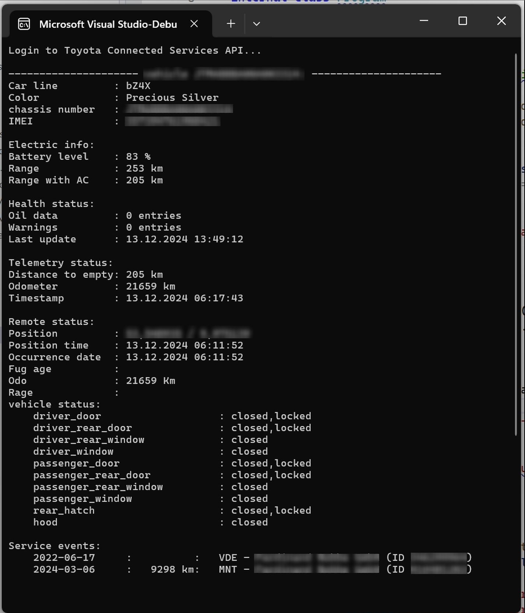

# Abraham.MyToyotaClient

    


## OVERVIEW

Connects to Toyota Connected Services API and retrieves data about your Toyota cars.
You can use this Nuget package to read out the current battery level, range or geo position.
Please take a look at my demo to find out the individual values.


## CREDITS
Many thanks to the Toyota Connected Services Europe Python module by Simon Hansen!
He has published his client at https://github.com/DurgNomis-drol/mytoyota.
Many thanks to to Simon Hörrle and Arnav Jain who published the successor https://github.com/pytoyoda.


## CHANGES
The current version includes the function to request the realtime status of the battery.
Based on the latest version of https://github.com/pytoyoda.


## LICENSE

Licensed under Apache licence.
https://www.apache.org/licenses/LICENSE-2.0


## Compatibility

The nuget package was build with DotNET 8.


## INSTALLATION

Install the Nuget package "Abraham.MyToyotaClient" into your application (from https://www.nuget.org).

Add the following code:
```C#
using Abraham.MyToyotaClient;

var client = new MyToyota()
    .UseCredentials("MY USERNAME", "MY PASSWORD")
    .UseLogger( (string message) => Console.WriteLine(message))
    .UseTimeout(30);
client.Login();

var vehicles = client.GetVehicles();

foreach(var vehicle in vehicles.payload)
{
    Console.WriteLine($"Car line         : {vehicle.carlineName}");
    Console.WriteLine($"Color            : {vehicle.color}");
    Console.WriteLine($"chassis number   : {vehicle.vin}");
    // query more data with the other client methods
}
```


That's it!
Username and password should be the credentials you use to log in to MyToyota app on your phone.


## HOW TO INSTALL A NUGET PACKAGE
This is very simple:
- Start Visual Studio (with NuGet installed) 
- Right-click on your project's References and choose "Manage NuGet Packages..."
- Choose Online category from the left
- Enter the name of the nuget package to the top right search and hit enter
- Choose your package from search results and hit install
- Done!


or from NuGet Command-Line:

    Install-Package Abraham.MyToyotaClient


## AUTHOR

Oliver Abraham, mail@oliver-abraham.de, https://www.oliver-abraham.de

Please feel free to comment and suggest improvements!


## SOURCE CODE

The source code is hosted at:

https://github.com/OliverAbraham/Abraham.MyToyotaClient

The Nuget Package is hosted at: 

https://www.nuget.org/packages/Abraham.MyToyotaClient


## SCREENSHOTS

This shows the demo program displaying most of the data about my car:



# MAKE A DONATION !

If you find this application useful, buy me a coffee!
I would appreciate a small donation on https://www.buymeacoffee.com/oliverabraham

<a href="https://www.buymeacoffee.com/app/oliverabraham" target="_blank"></a>
